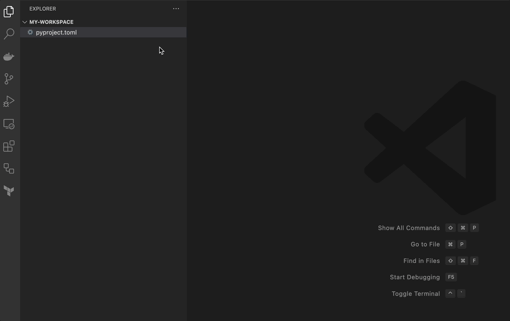

# pyproject.toml snippets

This extensions provides snippets to help with populating the content of
`pyproject.toml` files. These snippets are designed to simplify the process
of adding common configuration settings and dependencies to your project's
`pyproject.toml` files.

## Snippets

At the moment, only one snippet is available.

| Prefix      | Content                       |
|-------------|-------------------------------|
| `pyproject` | Sample pyproject.toml content |

## Usage

To use a snippet, simply type the name of the snippet and press Tab.
This will expand the snippet to include the appropriate syntax for the
pyproject.toml file.

## Contributing

If you have a suggestion for a new snippet or improvement to an existing one,
please open an issue or submit a pull request on the [GitHub repository](https://github.com/kamilturek/vscode-pyproject-toml-snippets).

## Change Log

Please see [`CHANGELOG.md`](./CHANGELOG.md).

## License

This extension is licensed under the [MIT License](./LICENSE.md).
